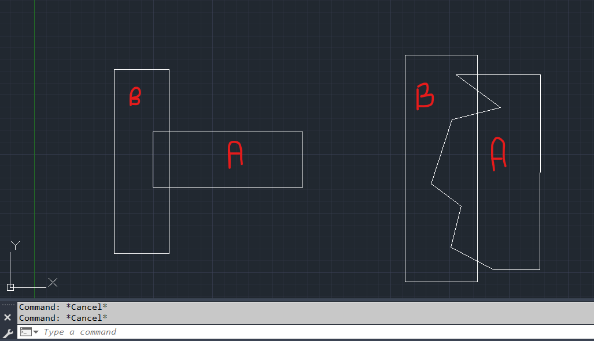
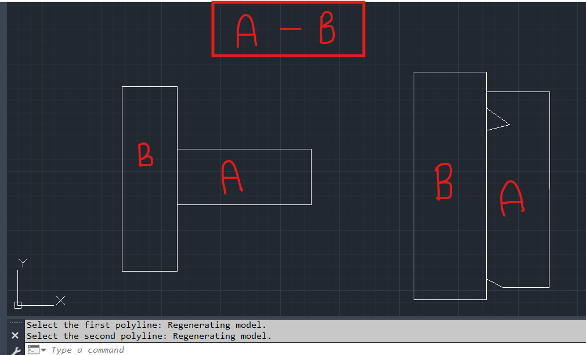

# FixPlOverlap

**FixPlOverlap** is an AutoCAD plugin that removes the overlapping portion between two polylines by subtracting the common area from the **first selected polyline**.

## Features

* Removes the overlapping section from the first selected polyline.
* Preserves the second selected polyline.
* Simple two-step selection workflow.
* Fast and lightweight.

## Usage

1. Load the `FixPlOverlap.dll` into AutoCAD.
2. Run the command:

```text
FIXPLOVERLAP
```

3. Select the **first polyline** (the one to be modified).
4. Select the **second polyline** (used as the subtraction boundary).
5. The overlapping portion is removed from the first polyline.

## Before



## After



## Requirements

* AutoCAD / Civil 3D
* .NET 8.0
* x64

## License

This project is licensed under the MIT License.
